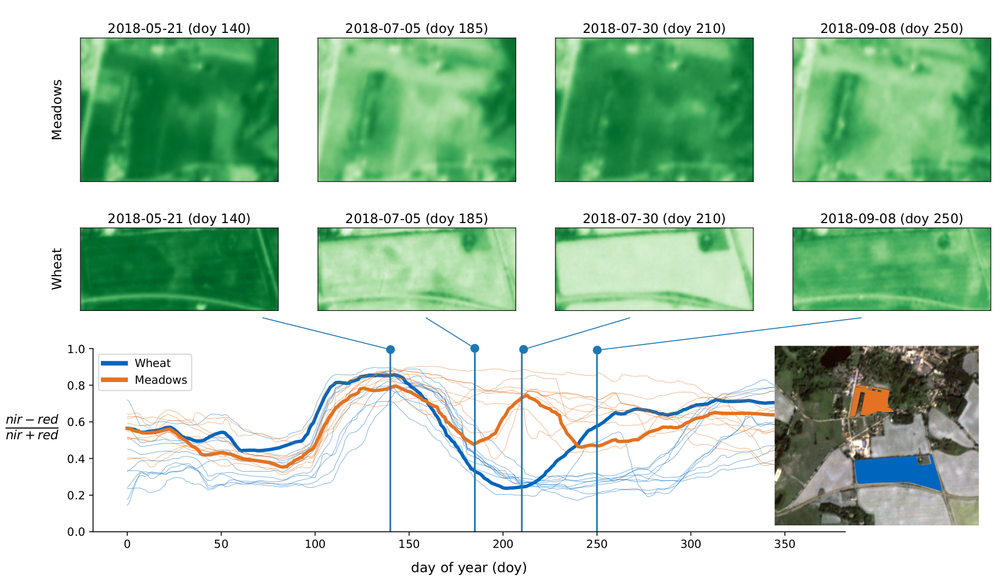

# DENETHOR - A dataset for crop type mapping from daily, analysis-ready satellite data


Recent advances in remote sensing products allow near-real time monitoring of the
Earth's surface. Despite increasing availability of near-daily time-series of satellite
imagery, there has been little exploration of deep learning methods to utilize
the unprecedented temporal density of observations. This may be particularly
interesting in crop monitoring where time-series remote sensing data has been used
frequently to exploit phenological differences of crops in the growing cycle over
time. Therefore, we introduce **DENETHOR**: The **D**ynamic**E**arth**NET** dataset for
**H**armonized, inter-**O**perabel, analysis-**R**eady, daily crop monitoring from space.
Our dataset contains daily, analysis-ready Planet Fusion data together with Sentinel-
1 and 2 time-series for crop type classification in Brandenburg, Germany. Our
baseline experiments underline that incorporating the available spatial and temporal
information fully may not be straightforward and could require the design of
tailored architectures. The dataset presents two main challenges to the community:
Exploit the temporal dimension for improved crop classification and ensure that
models can handle a domain shift to a different year.


If you use this dataset, please cite:

```
@article{kondmann2021denethor,
  title={DENETHOR: The DynamicEarthNET dataset for Harmonized, inter-Operable, analysis-Ready, daily crop monitoring from space},
  author={Kondmann, Lukas and Toker, Aysim and Ru{\ss}wurm, Marc and Camero, Andr{\'e}s and Peressuti, Devis and Milcinski, Grega and Mathieu, Pierre-Philippe and Long{\'e}p{\'e}, Nicolas and Davis, Timothy and Marchisio, Giovanni and others},
  journal = {NeurIPS Track on Datasets and Benchmarks},
  year={2021}
}
```


## Data Overview

We provide a combination of harmonized, declouded, daily Planet Fusion data at 3m resolution 
together with Sentinel-1 and 2 time series for high-quality field boundaries and crop ids in 
Brandenburg, Germany. Train and test tiles are spatially separated and taken from different 
years to encourage out-of-year generalization. Both tiles are identical in size with 24km × 24km.

## Download


Download our dataset as part of the AI4EO Food Security Challenge [here](https://platform.ai4eo.eu/ai4food-security-germany/data).
The full dataset including the test data will be released after the challenge.

Also check out a similar dataset we're involved in building for South Africa [here](https://platform.ai4eo.eu/ai4food-security-south-africa/data).


### Crop Type Classes

The field boundaries and crop type information is taken from the
German state of Brandenburg. This data is collected as part of the Common Agricultural Policy of
the European Union. Farmers self-report the crops they grow on their fields to receive subsidies. In
Germany, this data is controlled and administered on the state level. The data is not only geograph-
ically precise but also of high quality since a variety of checks via in-situ measurements or earth
observation data can potentially expose cheating.

The raw crop information provides the fields in vector format with a crop id coded between 1-999.
Fields with areas below 1km2 are excluded since they are often broken in shape and can not easily be
incorporated. We aggregate the crop type into a limited set of high-level classes. 
The nine classes with training frequencies in brackets are: Wheat
(305), Rye (276), Barley (137), Oats (45), Corn (251), Oil Seeds (201), Root Crops (23), Meadows
(954) and Forage Crops (339).

Crops that do not fit into these categories are rare in the reference data but in these instances, we
remove the respective fields instead of collecting them in a tenth ‘Other’ class. The class imbalance
provides a challenge for machine learning algorithms but it is representative of the geographic region
and an imbalance is generally common in real-world crop type mapping tasks.

### Planet Fusion Imagery

The main source of imagery is the Fusion Monitoring product 2 by Planet
Labs, a commercial provider of high-resolution satellite imagery. It is based on the Planetscope
constellation of Cubesats which collect images of the Earth from over 180 small satellites. The
product has a spatial resolution of 3m and collects 4 spectral bands (RGB + Near-infrared (NIR)). It
has several features that make it promising for crop monitoring.

First, it provides imagery in a unique daily time interval which allows studying the evolution of
crops in unprecedented temporal density. Second, the time series is an analysis-ready data (ARD), 
level 3 product. It delivers a temporally consistent collection of images with removed clouds and 
shadows. Third, it is a Harmonized Landsat Sentinel-2 (HLS) time series, meaning that the data is 
interoperable with Landsat and Sentinel-2 data.

### Sentinel Data

To combine and compare Planet and the publicly available Sentinel data, we include
imagery from Sentinel-1 and Sentinel-2 to the train and test tile. While the spatial and temporal
depth of S2 is comparably low, the combination of spectral depth (S2) with spatial and temporal
depth (Planet Fusion) may provide additional opportunities for crop type mapping.


*Examples of meadow and wheat parcels from the training dataset. The upper images show
two parcels at four (of 365) acquisition times. The bottom plot shows the Normalized Difference
Vegetation Index NDVI averaged over all pixels of these parcels. For reference, other fields
meadow and wheat fields are plotted in thin lines which illustrates that wheat and meadow vary
systematically between day 180 and 240. Meadows remain photo-synthetically active (high NDVI)
while wheat has been harvested.*


## Requirements 

```
pip install -U -r requirements.txt
```

## Training

```
python train.py 
    mobilenet_v3_small #Spatial Encoder. If "none" => pixel average
    transformermodel #Temporal Encoder
    --logdir /tmp 
    --datapath /ssd/DENETHOR/PlanetL3H/Train/PF-SR 
    --labelgeojson /ssd/DENETHOR/crops_train_2018.geojson
    --batchsize 12 --workers 8
```

## Test a model 
requires a model checkpoint in the log directory
```
python test.py 
    mobilenet_v3_small #Spatial Encoder. If "none" => pixel average
    transformermodel #Temporal Encoder
    --logdir /tmp 
    --datapath /ssd/DENETHOR/PlanetL3H/Test/PF-SR 
    --labelgeojson /ssd/DENETHOR/crops_test_2019.geojson
    --batchsize 24
```


## Train/Test PSETAE
separate script for testing & training PSETAE models
```
python test_psetae.py 
    --modelname psetae 
    --logdir /tmp 
    --datapath /ssd/DENETHOR/PlanetL3H/Test/PF-SR 
    --labelgeojson /ssd/DENETHOR/crops_test_2019.geojson
    --batchsize 24
```
## RF Models with S1/S2

In case you want to run this, adjust the respective paths in random_forest.py

## Tests

test all spatio-temporal model combinations
```angular2html
pytest tests.py
```

test single configuration (e.g. resnet18 + lstm)
```
pytest tests.py -k "test_spatiotemporalmodel[resnet18-lstm]"
```
